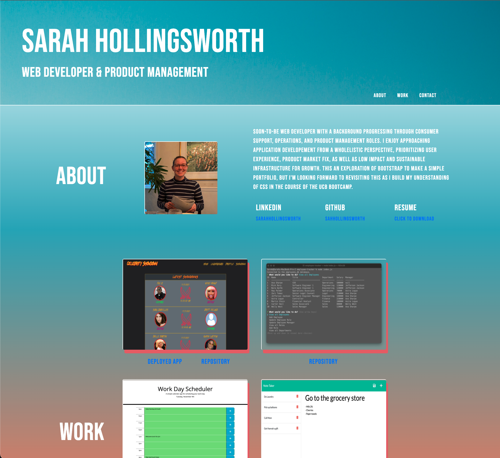

# Portfolio
This another version of my web development portfolio, built to be lightweight, responsive, and mobile first. It includes developer's contact information, links to the developer's professional websites, a display of projects, and the ability to download a PDF of my resume.

This 3rd portfolio also serves as an exploration of Bootstrap.

## Summary
Click here to see the deployed portfolio.

* Portfolio includes core information either available on load or easy to discover to be useful job-seeking tools
* 3 sections
  * About - General Information about the developer
  * Work - Previous projects
  * Contact - Contact information to reach the developer
* About section
  * Developer name,
  * Recent photo
  * Personal summary or bio
  * Developer LinkedIn
  * Developer GitHub
  * Developer Resume download
* Work section
  * Grid layout displaying key projects
  * link to each deployed project
  * link to each repository
* Contact section
  * Developer telephone
  * Developer email
  * Developer medium link

## Installation
As this is a very lightweight portfolio, installation only requires cloning the repository to your local machine.

## Future Development
* Add a contact form for site visitor to be able to send a message to the developer. 
  * Implementation should be straightforward, section already exists. Missing a third-party backend provider to handle message generation to email from form submission.

## Technologies used
* [Bootstrap](https://getbootstrap.com/docs/5.0/getting-started/introduction/) - Style and icon framework.
* [CSS](https://devdocs.io/css/) - Used to style html elements on the page as needed beyond Bootstrap.
* [HTML]((https://developer.mozilla.org/en-US/docs/Web/HTML) -Used to create elements on the DOM.
* [Git](https://git-scm.com/doc) - Version control system to track changes to source code.
* [GitHub](https://docs.github.com/en) - Hosts the code repository.

## Author
Sarah Hollingsworth
* [Github](https://github.com/sahhollingsworth)
* [LinkedIn](https://www.linkedin.com/in/sarahhollingsworth/)

## Acknowledgements
* Reset.css in public domain, found at [Meyer Web](http://meyerweb.com/eric/tools/css/reset/)

## License
* [MIT](https://opensource.org/licenses/MIT) license